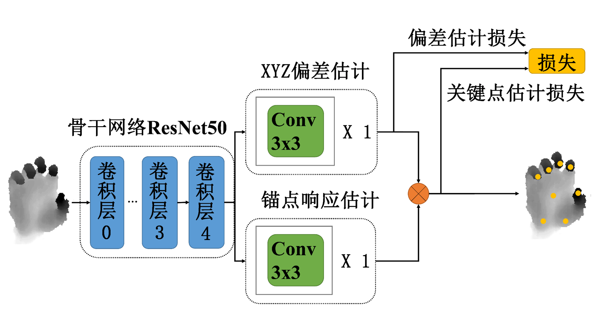
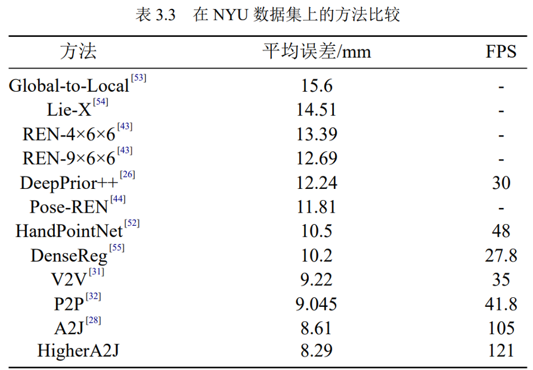
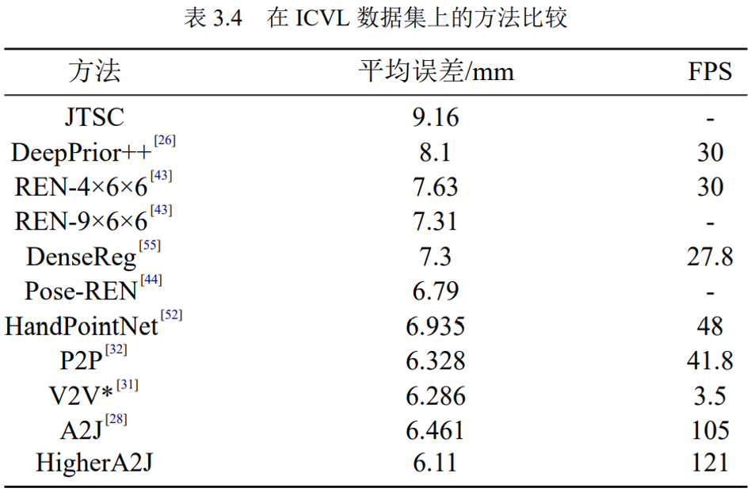
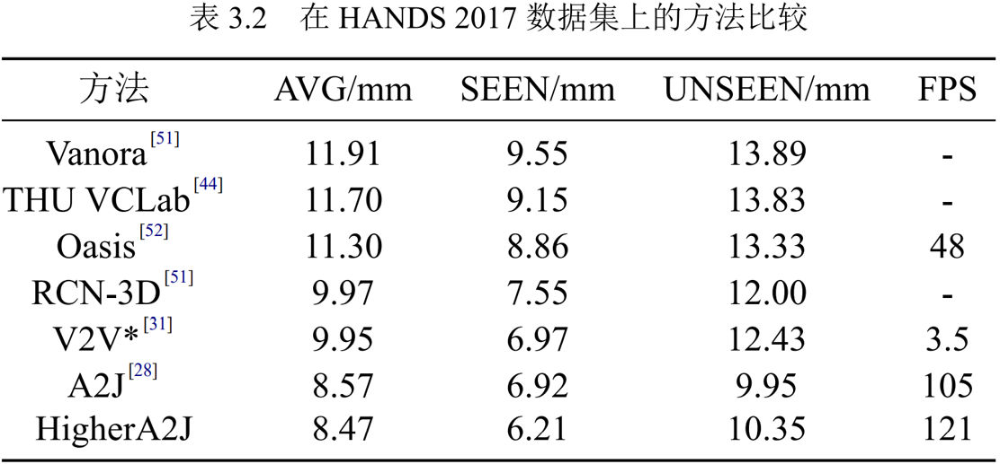
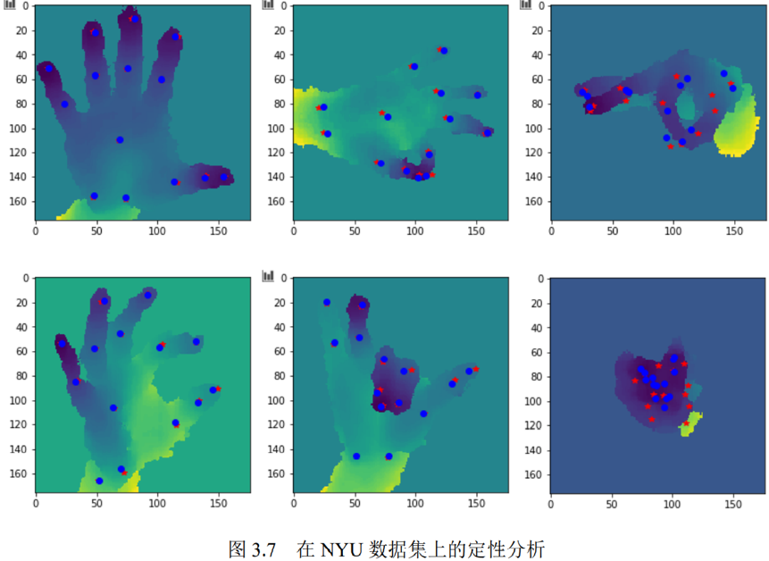

## 前言

论文《改进的基于锚点的三维手部姿态估计网络》的官方实现

Official implementation of paper "Improved 3D hand pose estimation network based on anchor"

危德健,王文明,王全玉,任好盼,高彦彦,王志.改进的基于锚点的三维手部姿态估计网络[J/OL].计算机应用:1-8[2021-06-27].http://kns.cnki.net/kcms/detail/51.1307.TP.20210603.1127.005.html.

## 论文摘要

近年来基于锚点的三维手部姿态估计方法比较流行，A2J(Anchor-to-Joint)是比较有代表性的方法之一。A2J 在深度图上密集地设置锚点，利用神经网络预测锚点到关键点的偏差以及每个锚点的权重。A2J 使用预测的偏差和权重，以加权求和的方式计算关键点的坐标，降低了网络回归结果中的噪声。虽然 A2J 简单高效，但是不恰当的网络结构和损失函数影响了网络的准确度，因此文中提出改进的网络 HigherA2J。首先，使用一个分支预测锚点到关键点的 XYZ 偏差，更好地利用深度图的3D 特性；其次，简化 A2J 的网络分支结构从而降低网络参数量；最后，设计关键点估计损失函数，结合关键点估计损失和偏差估计损失，有效提高估计准确度。在三个数据集 NYU,ICVL 和 HANDS 2017 上的实验结果显示，手部姿态估计的平均误差比A2J 都有所降低，分别降低了 0.32mm，0.35mm 和 0.10mm。

## 网络结构



## 下载

预训练模型和hands2017数据的预处理关键点文件通过百度云下载

```
链接：https://pan.baidu.com/s/124-mmIbdYgDkCZQOsEMu_A 
提取码：oke0 
```

## 效果










# 致谢

非常感谢 @zhangboshen 的论文和代码(https://github.com/zhangboshen/A2J)
